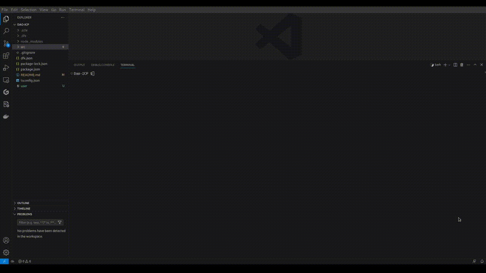
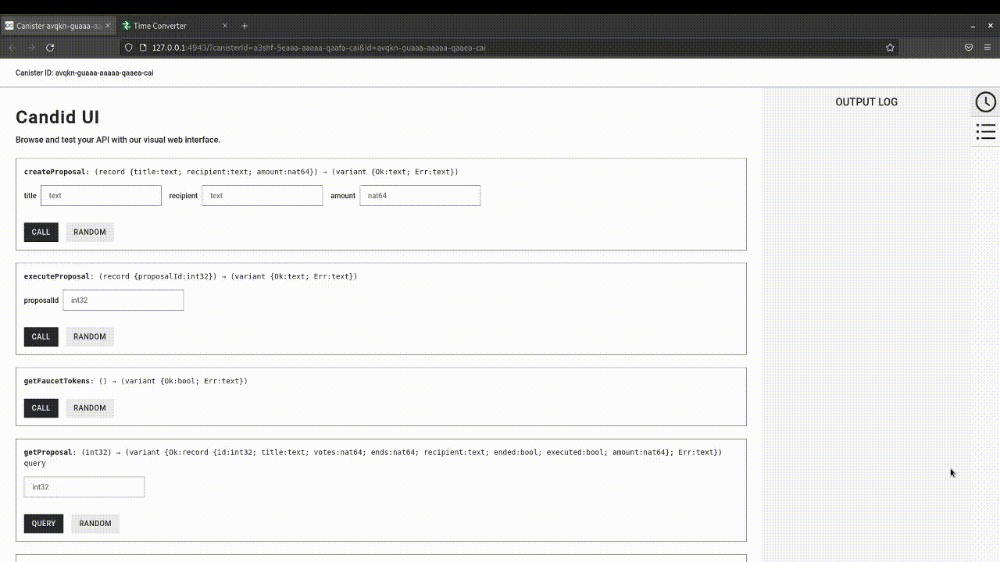
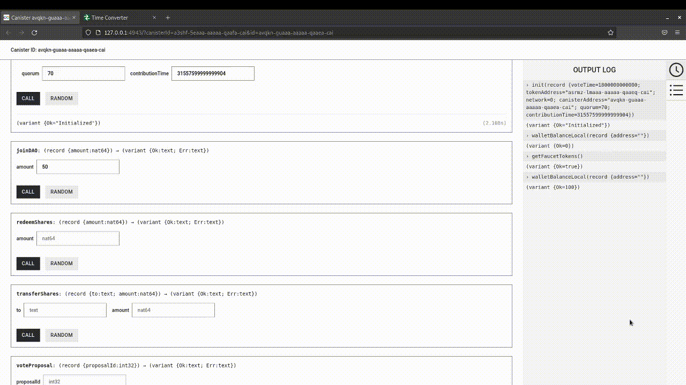
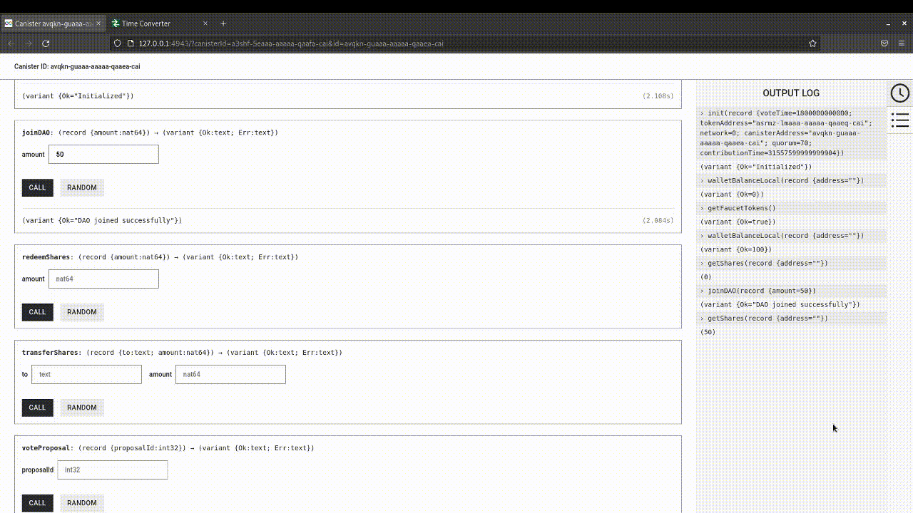
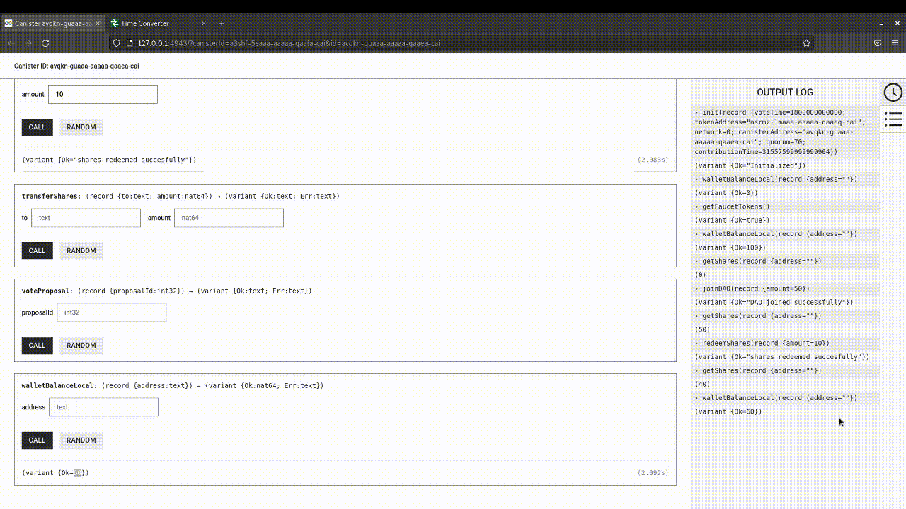
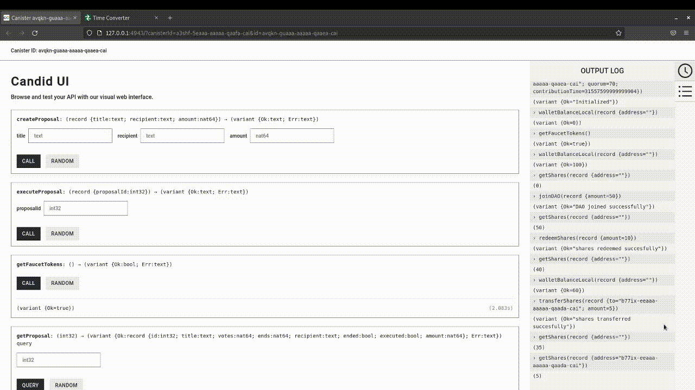
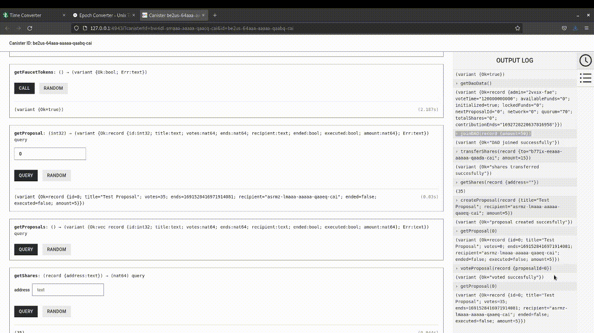

# DAO

## Disclaimer

This is a test canister and should not be used in production.

This DAO contract:

- Collects investors money (ICP) & allocate shares
- Keep track of investor contributions with shares
- Allow investors to transfer shares
- Allow investment proposals to be created and voted
- Execute successful investment proposals (i.e send money)
- The number of votes an investor has is equivalent to the number of shares the investor has.

## To start the Local Internet Computer

```bash
dfx start --background
```

To deploy the canister

```bash
dfx deploy
```

## Testing locally

Added the dummy tokens which allows users to test the canister locally.

Steps involved:

- Deploy canister `dfx deploy` and take note of the dao canister address and token canister address



- Run the `init` function setting the payload network to 0
  
        Parameters:
                - network: 0 for dummy tokens | 1 for ICP Ledger (use 0 for testing)
                - contributionTime: total duration of DAO in nanoseconds;
                - voteTime: time for voting in nanoseconds;
                - quorum: percentage of votes required to pass proposal from 0 - 100;
                - canisterAddress: address of DAO canister from deployment;
                - tokenAddress: address of Token Canister from deployment;



- Then claim faucet dummy tokens using the `getFaucetTokens` function


- Then you should be able to test the canister properly.

- `JoinDAO` Test
  
  

- `RedeemShares` Test
  
  

- `TransferShares` Test
  
  

- `Create Proposal` Test
  
  

- `Vote Proposal` Test
  
  

- `Execute Proposal` Test
  
  